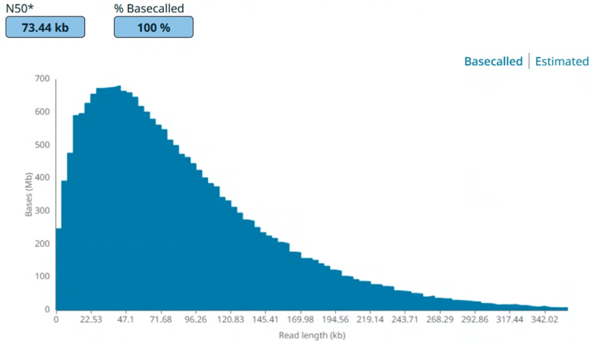
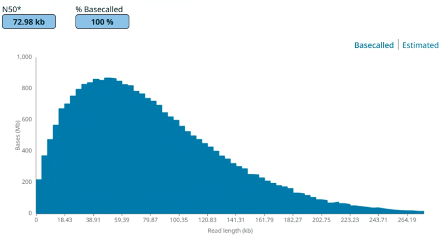
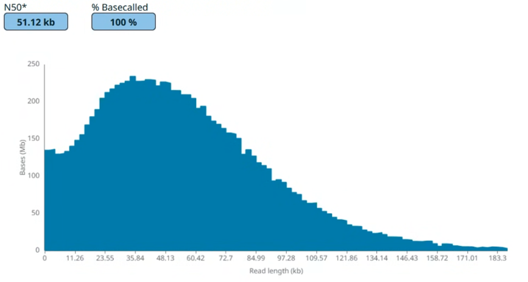
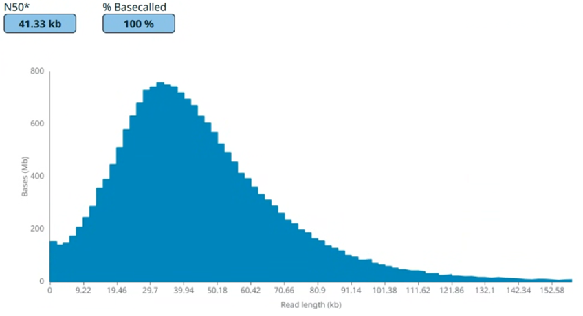
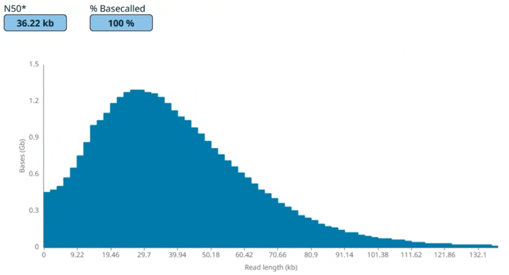
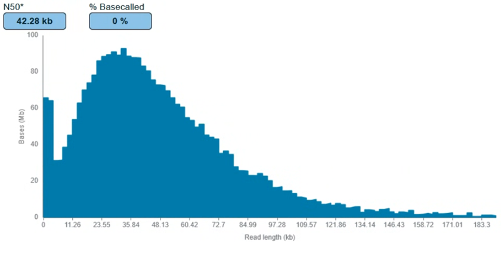
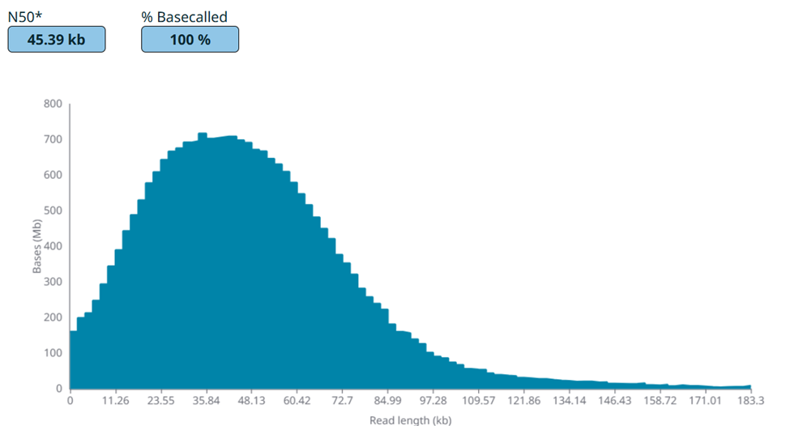
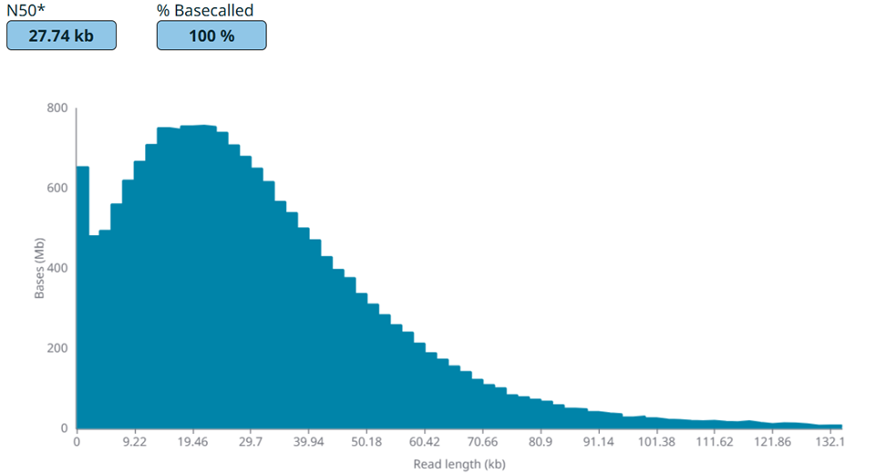
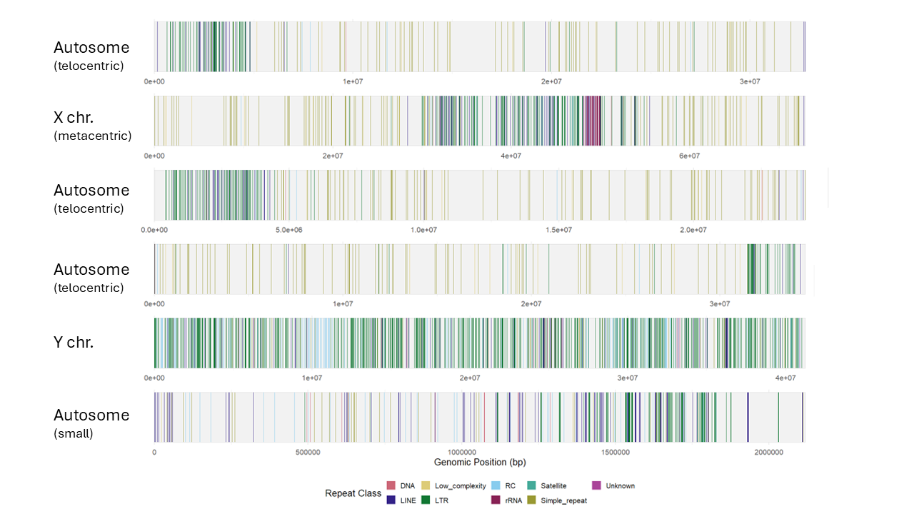

# Sequencing Milestones

Oxford Nanopore Technology (ONT) sequencing enables telomere-to-telomere complete genome assembly because of its potentially unlimited maximum read length. However, ideal read length observed from mammal or yeast DNA are not reproducible with DNA from some other eukaryotes. *Drosophila* are important model organisms but the community suffer from making long reads with ONT. People usualy get 15 to 25 kb of read N50 with current R10.4.1 Q20+ platform. The best N50 of *D. melanogaster* in publications is 28.3 kb ([Bernard Kim, et. al., PLOS Biology, 2024](https://doi.org/10.1371/journal.pbio.3002697)). [Another source](https://www.genomeark.org/t2t-raw-data-only/Drosophila_melanogaster.html) sayid their N50 values were 30 kb and 39.9 kb. No real telomere-to-telomere genome assembly is available for now. [This research](https://doi.org/10.1038/s41467-025-67031-w) did not assemble any centromeres. Their N50 (LSK109 kit) was 48.2 kb after size-selection by BluePippin system.

I optimized the entire workflow to improve the read N50 to 40+ kb or 70+ kb with the ligation sequencing kit (LSK114) or ultra-long sequencing kit (ULK114) respectively. Neither BluePippin nor SageHLS was used. This is the best know results so far. Part of the results were presented in the 67th Annual Drosophila Research Conference, 2026. I am aiming at the read N50 greater than 100 kb. All experiments were performed on a PromethION P2 Solo machine.

### The ultra-long sequencing kit yeilds N50 of 70+ kb

The sample was *D. pseudoobscura*. The throughput was 23GB in 20 hours on an used flowcell. 

The sample was the most common species, *D. melanogaster*. The throughput was 45.2GB in 20 hours and then 28.2 GB in 16 hr on a brand new flowcell.  
To my best search, there is no public available records of ONT ultra-long data of *Drosophila* so far. 

### The ligation sequencing kit yeilds N50 of 40+ kb

This is the result from the latest experimental protocol. The sample was *D. melanogaster*.

This is a typical result with the current stable workflow. The sample was *D. pseudoobscura*.

This is a typical result with the current stable workflow. The sample was *D. virilis*, whose genome contains 50% of heterochromatin and repettive satellites.

________

### Typical sequencing result with mammal DNA

It was performed side-by-side with another *Drosophila melanogaster* sample with the same protocol. The sequencing result at that time is:

_____________
# Finally, Longer Reads Give Better Genome Assembly!

In the past year, I found the bias of ONT sequencing which "hates" some kind of repetitive motifs. Depending on the kit (ULK114, LSK114, NBD114...), the coverage also fluctuate across the genome. By "leveraging" the bias and loooooooog reads, I just had a automatically complete genome of a common *Drosophila* species (Let's keep this species a secret and we are rushing on analysis.) Known telomere-specific TEs were detected in the ends of contigs (and we suspected there are few more lowkey).

## In conclusion, I would like to work on long-read sequencing more! Since DNA is nicely handled in my hands, I believe RNA will also behaves well! ONT sequencing detects base modifications directly. I would like to integrate their rich information along with other aspectes, such as, structural variants, transcriptomics,  population genetics, phylogenetics and more. Let's work together on genomics and beyond!
